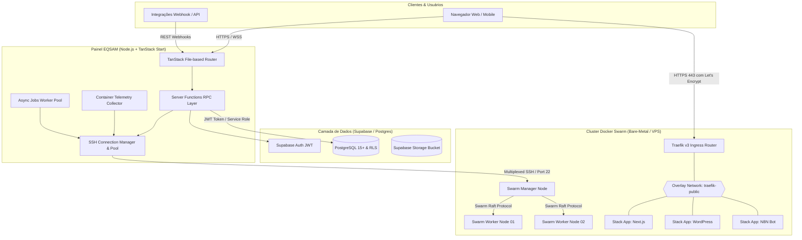

# Arquitetura Geral do Sistema

O **Painel EQSAM** foi concebido sob o paradigma de arquitetura desacoplada e distribuída, combinando a agilidade de um frontend reativo moderno com o poder de um backend resiliente capaz de gerenciar diretamente nós de infraestrutura em nuvem através de túneis SSH seguros.

---

## 🏛️ Topologia Holística

A infraestrutura é dividida em quatro camadas principais:
1. **Camada de Apresentação & SSR (BFF - Backend for Frontend):** Aplicação unificada em TanStack Start / React 19 executada em Node.js com tipagem estrita de rotas, layouts aninhados e funções de servidor (`createServerFn`).
2. **Camada de Persistência & Autenticação (Database Layer):** Instância PostgreSQL gerenciada via Supabase com Row Level Security (RLS), triggers para auditoria e controle de acesso baseado em papéis (RBAC).
3. **Camada de Transporte & Orquestração (Swarm Engine):** Módulo de conexão SSH persistente multiplexado (`ssh-connection-manager.server.ts`) com circuit breaker para interagir diretamente com os nós do Docker Swarm.
4. **Camada de Borda & Roteamento (Edge Ingress Layer):** Traefik v3 configurado nos nós Master/Manager do Swarm, escutando a rede overlay global `traefik-public` e provisionando certificados TLS com Let's Encrypt em tempo real.



---

## ⚡ Por que Docker Swarm Direto via SSH (Sem Coolify)?

Uma das decisões fundamentais de engenharia no Painel EQSAM foi a **eliminação deliberada de intermediários pesados como o Coolify**. 

### Razões Estratégicas:
1. **Sobrecarga Mínima de Hardware:** Soluções de terceiros introduzem daemons auxiliares, bancos de dados redundantes e dezenas de contêineres de controle que consomem gigabytes de memória RAM dos servidores. Com o Painel EQSAM, o servidor precisa apenas do daemon nativo do Docker Swarm (`dockerd`) e de uma porta SSH aberta.
2. **Confiabilidade e Ausência de Drift:** Em ferramentas terceiras, qualquer divergência de estado entre o banco da ferramenta e o estado real dos contêineres gera travamentos silenciosos. No EQSAM, os comandos de gerenciamento de stacks (`docker stack deploy`, `docker service ls`, `docker service update`) são executados e validados diretamente no nó Swarm Master via SSH.
3. **Isolamento de Falhas (Fail-Safe):** Se o Painel EQSAM reiniciar ou entrar em manutenção, todas as aplicações dos clientes continuam rodando sem nenhuma interrupção no Docker Swarm, pois o orquestrador é independente e distribuído via Raft consensus.
4. **Portabilidade Universal:** Qualquer servidor Linux (Ubuntu 22.04/24.04, Debian 12, Rocky Linux) pode ser adicionado ao cluster instantaneamente configurando apenas SSH e rodando `docker swarm init` ou `docker swarm join`.

---

## 🔌 Camada de Transporte SSH Multiplexada

O gerenciador de conexões SSH (`src/lib/ssh-connection-manager.server.ts`) implementa padrões industriais de engenharia de software:

### Características da Conexão:
- **Connection Pooling por Host:** Mantém conexões SSH ativas persistentes com keepalive periódico (intervalo de 15 segundos) para evitar handshakes repetidos a cada requisição.
- **Multiplexação de Canais:** Sobre uma única conexão TCP autenticada, múltiplos canais de execução (`Client.exec()`) operam simultaneamente protegidos por um semáforo de concorrência máxima (default: 10 canais por host).
- **Thundering Herd Prevention:** Se múltiplas requisições simultâneas solicitarem conexão ao mesmo servidor offline, apenas uma tentativa de handshake físico é disparada; as demais se enfileiram e aguardam a mesma Promise.
- **Circuit Breaker com 3 Estados:**
  - `CLOSED`: Operação normal, chamadas passam diretamente.
  - `OPEN`: Quando falhas consecutivas de rede ocorrem (limiar: 3 tentativas), o circuito abre temporariamente (resfriamento de 30 a 60 segundos), retornando erro imediato sem sobrecarregar a rede ou travar o pool.
  - `HALF_OPEN`: Após o tempo de resfriamento, uma chamada de teste é permitida. Se for bem-sucedida, o circuito se fecha; caso contrário, reabre.
- **Sanitização de Segredos:** Todo comando antes de ser registrado em log passa por `secret-sanitizer.ts`, expurgando senhas, chaves de API, tokens JWT e strings de conexão de banco de dados.

---

## 🌐 Roteamento de Borda com Traefik v3

O tráfego externo para os serviços provisionados é roteado dinamicamente pelo **Traefik v3**, que roda como um serviço global ou replicado na rede overlay `traefik-public`.

### Como o Roteamento Dinâmico Funciona:
Ao provisionar uma aplicação no Swarm, o painel injeta automaticamente rótulos declarativos (`labels`) no serviço:

```yaml
version: '3.8'
services:
  app:
    image: meurepositorio/minha-app:latest
    networks:
      - traefik-public
    deploy:
      replicas: 1
      labels:
        - "traefik.enable=true"
        - "traefik.docker.network=traefik-public"
        - "traefik.http.routers.app-meudominio.rule=Host(`meudominio.com.br`) || Host(`minhaapp.dk1.eqsam.com`)"
        - "traefik.http.routers.app-meudominio.entrypoints=websecure"
        - "traefik.http.routers.app-meudominio.tls=true"
        - "traefik.http.routers.app-meudominio.tls.certresolver=letsencrypt"
        - "traefik.http.services.app-meudominio.loadbalancer.server.port=3000"
networks:
  traefik-public:
    external: true
```

O Traefik detecta o novo serviço via Docker Socket do Swarm, cria a rota em microssegundos e dispara o desafio HTTP-01 para emissão do certificado SSL com a autoridade certificadora Let's Encrypt. Zero intervenção manual de Nginx ou Apache.
