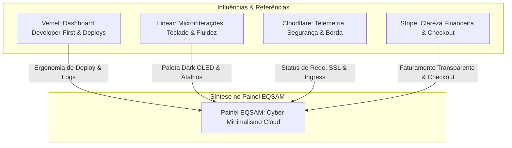

# Inspiração & Filosofia de UX

O design do **Painel EQSAM** foi concebido a partir da convergência estética e funcional dos produtos digitais mais elogiados da engenharia de software contemporânea: **Vercel**, **Linear**, **Cloudflare** e **Stripe**.

O objetivo primordial foi construir um painel para desenvolvedores, sysadmins e clientes corporativos que unisse **velocidade brutal, clareza cirúrgica de dados e beleza visual sofisticada**, abandonando definitivamente o padrão visual antiquado de painéis de hospedagem tradicionais (como cPanel ou Plesk dos anos 2000).

---

## 🧭 Pilares de Inspiração

### 1. Vercel — Experiência do Desenvolvedor (DX)
- **Deploy Sem Atrito:** O ato de colocar uma aplicação no ar é reduzido a poucos cliques: escolha um template ou aponte o repositório Git e o painel cuida de todo o pipeline.
- **Transparência de Logs:** O terminal de build e logs em tempo real reproduz a sensação de estar conectado localmente ao contêiner, com auto-scroll inteligente e quebras de linha limpas.
- **Hierarquia Visual:** Títulos limpos, espaçamento generoso e uso inteligente de superfícies elevadas (`surface-card`).

### 2. Linear — Fluidez e Cyber-Minimalismo
- **Paleta OLED Noturna:** O fundo `#000606` com cartões `#040e0e` e bordas `#0e2424` elimina a fadiga ocular em sessões prolongadas de trabalho.
- **Uso Intencional da Cor:** A cor vibrante (Neon Lime / Esmeralda) não é decorativa; ela é um vetor de atenção funcional, indicando exclusivamente sucesso, foco ativo ou ações de confirmação primária.
- **Microinterações:** Transições suaves de opacidade e cor (150ms a 200ms com curva `ease-in-out`), sem animações espalhafatosas ou lentas que prejudiquem a produtividade.

### 3. Cloudflare — Visibilidade e Telemetria de Borda
- **Métricas Vivas:** A telemetria de contêineres e o status dos nós do cluster são exibidos como instrumentos de precisão de um cockpit de aviação: porcentagem de uso de CPU, limites de RAM, IOPS e saúde do proxy Traefik.
- **Gerenciamento de Domínios:** Verificação proativa de DNS antes de tentar gerar certificados SSL, alertando o usuário sobre apontamentos pendentes com diagnósticos claros.

### 4. Stripe — Confiança Financeira e Transparência
- **Faturas Elegantes:** Layout limpo com código de barras, QR Code PIX instantâneo e detalhamento linha a linha de cada recurso consumido.
- **Histórico Completo:** Linha do tempo de pagamentos, comprovantes baixáveis em PDF e controle de créditos em carteira.

---

## 🎯 Princípios de Usabilidade (UX Guidelines)

### 1. Erros Auto-Explicativos e Ação Imediata
Nenhum erro no Painel EQSAM deve ser genérico ou opaco. Em caso de falha (por exemplo, tentativa de subir um template com requisitos de hardware superiores ao plano contratado):
- **O que aconteceu:** "Memória insuficiente para o template selecionado".
- **Por que ocorreu:** "O template N8N requer 2048 MB de RAM, mas o serviço atual possui cota de 1024 MB".
- **O que fazer agora:** Um botão direto de "Fazer Upgrade de Plano" ou a recomendação de um template mais leve compatível.

### 2. Feedback Otimista e Não-Bloqueante
Ao alternar o estado de um contêiner (ex: Iniciar, Parar ou Reiniciar):
- O status visual muda imediatamente no frontend com indicador de processamento.
- A mutação no backend ocorre em segundo plano via SSH2.
- Caso ocorra falha no cluster, o estado reverte com uma notificação toast detalhada.

### 3. Prevenção de Ações Destrutivas
Ações com impacto severo (destruição de contêiner, formatação de diretório ou exclusão de banco de dados) exigem confirmação explícita de dois fatores no modal, como digitar o nome da aplicação ou selecionar um checkbox de consentimento antes de habilitar o botão de destruição.
