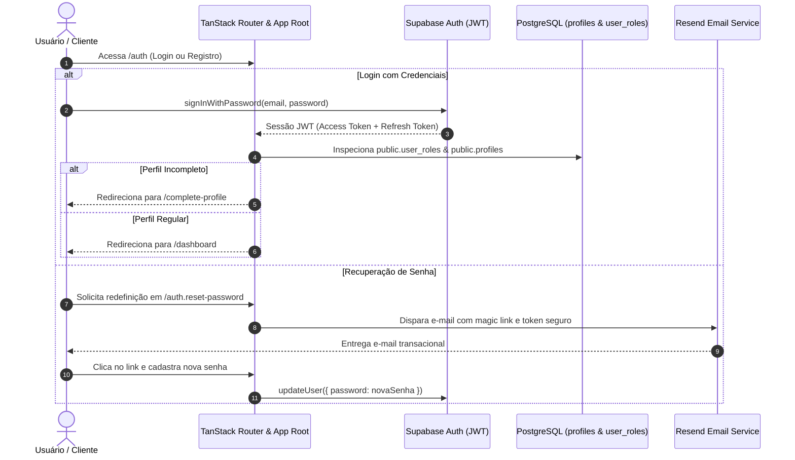

# Autenticação & Gestão de Perfil

O módulo de identidade e controle de sessão do **Painel EQSAM** integra o motor de autenticação gerenciado do **Supabase Auth** com políticas avançadas de perfil de cliente e conformidade cadastral brasileira.

---

## 🔐 Mecanismo de Autenticação

A camada de autenticação atua nas rotas `/auth`, `/auth.reset-password` e nos interceptores globais do TanStack Router:

---

## 👤 Fluxo de Conclusão de Perfil (`/complete-profile`)

Para emissão legal de faturas fiscais, ativação de planos e prevenção contra fraudes financeiras, todo novo usuário passa obrigatoriamente pela verificação de dados cadastrais caso ainda não possua o cadastro completo:

### Campos Obrigatórios:
- **Tipo de Pessoa:** Pessoa Física (CPF) ou Pessoa Jurídica (CNPJ).
- **Documento Fiscal:** Validação algorítmica de dígitos verificadores de CPF/CNPJ.
- **Nome Completo ou Razão Social.**
- **Telefone Celular / WhatsApp:** Utilizado para envio de comprovantes PIX e alertas urgentes de infraestrutura.
- **Endereço Completo:** CEP, logradouro, número, complemento, bairro, cidade e estado.

---

## 🛡️ Gestão de Sessões e Cookies de Segurança

O sistema opera sob modelo híbrido:
1. **No Cliente (SPA / Browser):** O SDK do Supabase gerencia o ciclo de renovação automática do JWT (`access_token` com expiração de 1 hora) e `refresh_token`.
2. **No Servidor (SSR & Server Functions):** A função de sessão extrai o token dos cabeçalhos da requisição (`Authorization: Bearer <token>` ou cookies autenticados), garantindo que as Server Functions executem sempre sob o contexto real do usuário logado via `supabaseAdmin.auth.getUser(token)`.

---

## ⚙️ Edição de Perfil & Segurança da Conta

Na rota `/profile`, o usuário dispõe de:
- **Dados Pessoais:** Atualização de nome, WhatsApp, endereço e e-mail.
- **Troca de Senha:** Confirmação da senha antiga seguida pela nova credencial com medidor de entropia.
- **Histórico de Acessos Recentes:** Exibição do último login, IP registrado e sistema operacional.
- **Token de API Pessoal:** Geração de chaves de API com permissões restritas para automações externas e deploys via CI/CD.
