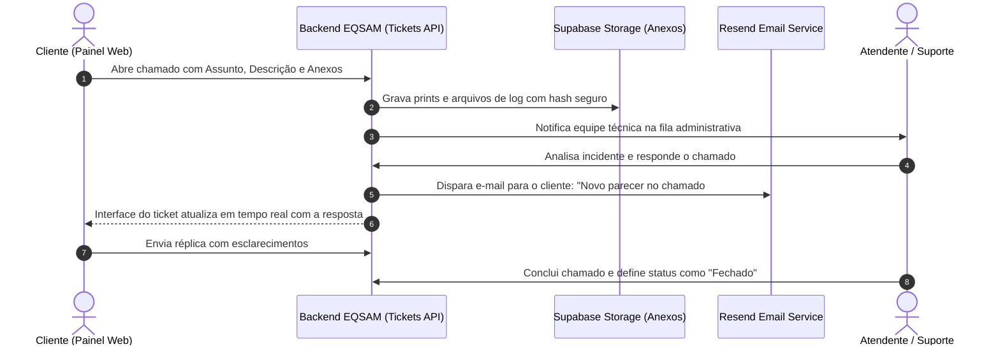

# Central de Suporte & Chamados (Tickets)

O módulo de suporte do **Painel EQSAM** (`/tickets` e `/tickets/$ticketId`) centraliza o relacionamento técnico e comercial entre o cliente e a equipe de atendimento através de um sistema de chamados estruturado, seguro e auditável.

---

## 🎫 Estrutura de um Chamado de Suporte

Cada ticket é composto pelos seguintes metadados fundamentais:

| Atributo | Valores Possíveis | Descrição / Comportamento |
| :--- | :--- | :--- |
| **Departamento** | *Suporte Técnico, Financeiro, Infraestrutura, Comercial* | Roteia a notificação interna para a equipe especializada competente. |
| **Prioridade** | *Baixa, Média, Alta, Urgente* | Define o SLA de primeira resposta e o destaque visual na fila do painel administrativo. |
| **Status** | *Aberto, Em Atendimento, Aguardando Cliente, Respondido, Fechado* | Controla o ciclo de vida do chamado e o fechamento automático por inatividade. |
| **Serviço Vinculado** | *Opcional (App Cloud, VPS ou Hospedagem)* | Conecta o chamado a um serviço específico, permitindo ao atendente inspecionar logs e status de imediato. |

---

## 💬 Fluxo de Comunicação & Troca de Mensagens

A experiência de atendimento foi desenhada como uma conversa contínua em formato de linha do tempo:

---

## 📎 Gestão de Anexos e Arquivos de Diagnóstico

- **Upload Seguro:** Envio direto de capturas de tela (`.png`, `.jpg`, `.webp`), arquivos de configuração (`.env`, `.yaml`, `.json`) e arquivos compactados (`.zip`, `.log`).
- **Isolamento de Acesso:** Os arquivos são gravados em buckets privados com URLs assinadas e expiração temporária, impedindo acesso de terceiros não autenticados.
- **Visualizador Integrado:** Imagens anexadas contam com visualização em modal (Lightbox) direto na interface, sem necessidade de download prévio.

---

## 🔔 Notificações Multicanal

Para evitar que o cliente precise manter a aba do navegador aberta para saber se sua solicitação foi atendida:
1. **E-mail Transacional Instantâneo:** Disparado via Resend com o resumo da resposta do atendente e botão de acesso direto ao chamado.
2. **WhatsApp Notification (Opcional):** Disparo de mensagem no WhatsApp cadastrado no perfil com aviso de resposta e link do chamado.
