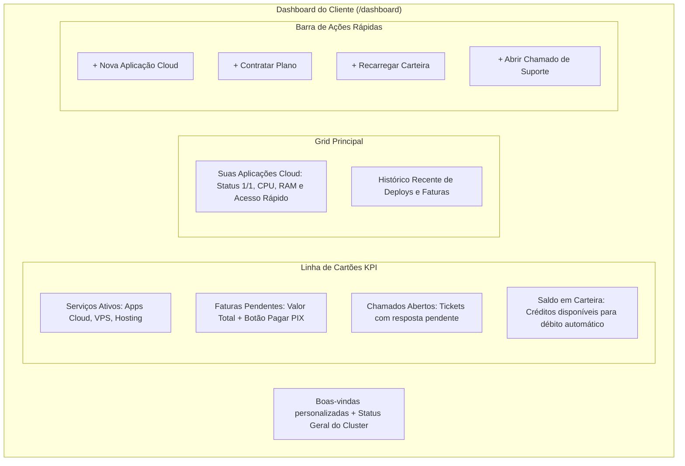

# Dashboard & Central de Controle

A rota principal do cliente (`/dashboard`) atua como a central de comando unificada, agregando o estado operacional de todos os recursos contratados em uma interface de alta densidade informacional.

---

## 📊 Estrutura e Indicadores Principais

O painel foi projetado para responder em menos de 3 segundos às três perguntas fundamentais de qualquer cliente:
1. *Meus sistemas e contêineres estão no ar?*
2. *Tenho alguma fatura pendente que possa interromper meus serviços?*
3. *Como estão meus chamados de suporte em andamento?*

---

## 🎯 Seções Detalhadas do Dashboard

### 1. Banner de Alerta e Integridade Operacional
No topo da tela, uma faixa informativa dinâmica exibe o status de saúde dos servidores do cluster:
- Se todos os nós estiverem operacionais, um badge verde pulsante informa: `Todos os nós do cluster operando normalmente`.
- Caso haja alguma manutenção programada ou instabilidade em um nó específico, uma notificação âmbar ou vermelha é projetada com link para a página de status.

### 2. Painel de Aplicações Cloud em Execução
Lista direta dos contêineres ativos do cliente com:
- **Identificação:** Nome do app, template utilizado (ex: Next.js, WordPress, N8N) e subdomínio associado.
- **Status do Contêiner:** Indicador visual de réplicas em execução (`1/1 Online` ou `0/1 Offline`).
- **Recursos em Tempo Real:** Medidor visual de consumo de CPU e Memória RAM.
- **Botões Rápidos:** Acesso direto à URL do app, gerenciador de arquivos e logs em tempo real.

### 3. Widget de Faturamento & Pagamento com 1-Clique
Se houver faturas com status `pending` ou `overdue`:
- O cartão assume realce âmbar/vermelho com o valor consolidado a pagar.
- Um botão proeminente "Pagar Agora via PIX" abre imediatamente o modal com o QR Code e código Copia e Cola, sem necessidade de navegar para a página de faturas.

### 4. Atalhos de Ação Rápida (Floating / Quick CTAs)
- **Criar Nova Aplicação:** Redireciona para o catálogo de 21 templates (`/apps/create`).
- **Contratar Planos:** Abre o checkout com os produtos disponíveis (`/plans`).
- **Adicionar Crédito:** Redireciona para a carteira virtual (`/wallet`).
- **Suporte:** Abre modal para abertura expressa de chamado (`/tickets`).
