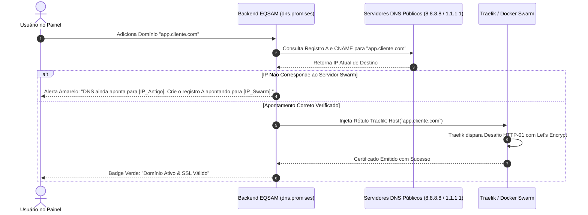

# Domínios Customizados & SSL Automático

O gerenciamento de domínios e certificados de segurança no **Painel EQSAM** foi arquitetado para ser completamente transparente, automatizando a configuração de rotas de borda e a emissão de certificados criptográficos TLS/SSL através do **Traefik v3** e **Let's Encrypt**.

---

## 🌐 Subdomínios do Sistema vs. Domínios Próprios

Ao criar qualquer aplicação na plataforma, o usuário tem acesso a duas camadas de conectividade:

1. **Subdomínio do Sistema (Instantâneo):**
   - A aplicação recebe imediatamente um endereço público funcional (ex: `https://meuapp.dk1.eqsam.com`).
   - O DNS wildcard já está pré-configurado nos servidores DNS autoritativos da EQSAM, permitindo testes e homologações instantâneas sem depender de compras de domínio.
2. **Domínio Personalizado Próprio:**
   - O cliente pode vincular seu próprio domínio ou subdomínio (ex: `meusite.com.br` ou `api.minhaempresa.com`).
   - Múltiplos domínios podem apontar para a mesma aplicação simultaneamente.

---

## 🔍 Verificador Proativo de DNS em Tempo Real

Para evitar falhas na emissão de certificados SSL (que ocorrem quando o Let's Encrypt tenta validar um domínio cujo DNS ainda não propagou para o IP correto), o painel implementa um **validador de DNS proativo** (`src/lib/domains.server.ts`):

### Instruções de Apontamento Fornecidas ao Cliente:
- **Para Domínio Raiz (`meusite.com.br`):**
  - **Tipo:** `A`
  - **Nome:** `@`
  - **Destino:** `IP_DO_SERVIDOR_SWARM` (ex: `161.97.104.148`)
- **Para Subdomínio (`app.meusite.com.br`):**
  - **Tipo:** `CNAME`
  - **Nome:** `app`
  - **Destino:** `meuapp.dk1.eqsam.com`

---

## 🔒 Ciclo de Vida do Certificado SSL/TLS

- **Emissão 100% Automatizada:** Assim que o apontamento é validado, o Traefik intercepta a primeira requisição na porta 80, responde ao desafio `.well-known/acme-challenge/` e armazena o certificado no volume criptografado `acme.json`.
- **Forçar HTTPS:** Todas as requisições HTTP na porta 80 são redirecionadas automaticamente com código HTTP 301 (Permanent Redirect) para a porta segura HTTPS 443.
- **Renovação Silenciosa:** O Traefik monitora a data de expiração dos certificados e realiza a renovação automática 30 dias antes do vencimento, sem qualquer tempo de inatividade.
