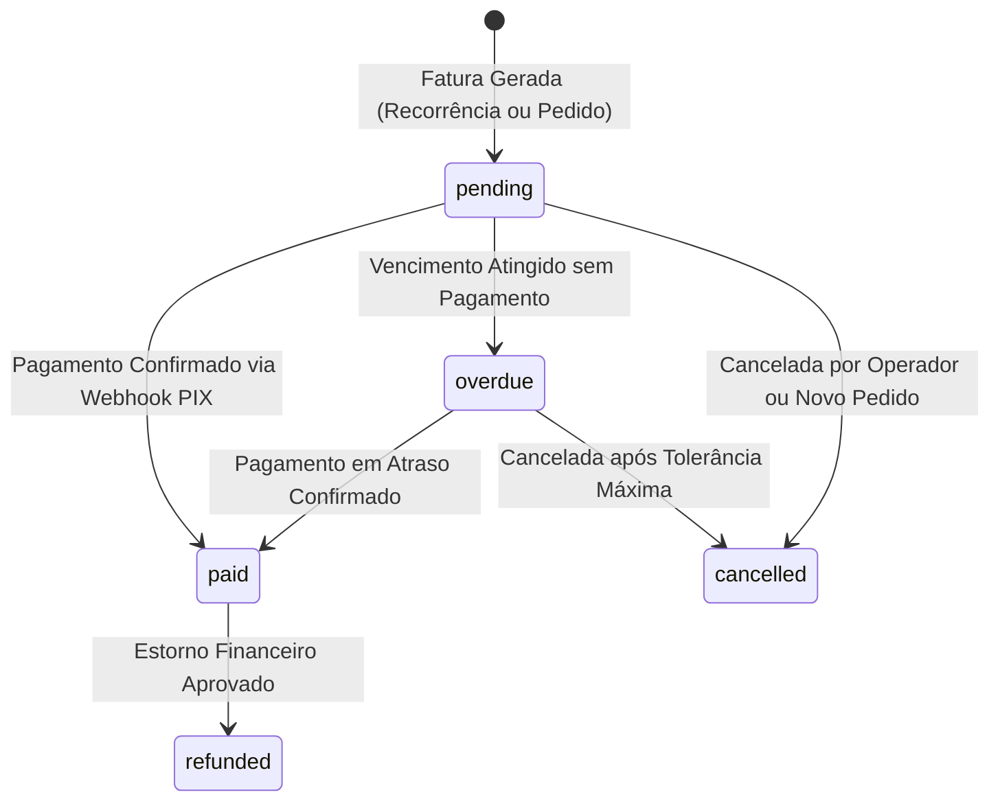
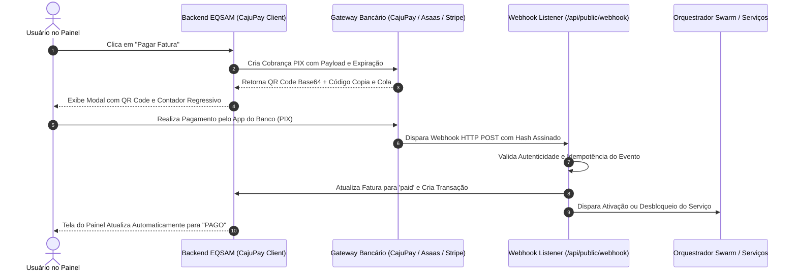

# Financeiro, Faturas e Carteira Digital

O subsistema financeiro do **Painel EQSAM** (`/invoices`, `/invoices/$invoiceId` e `/wallet`) fornece conciliação em tempo real de pagamentos, cobranças recorrentes automáticas e uma carteira digital pré-paga para débitos instantâneos.

---

## 🧾 Ciclo de Vida da Fatura (Invoice Lifecycle)

Toda cobrança do sistema é regida pela tabela `public.invoices` e segue a máquina de estados:

### Estados da Fatura:
- **`pending` (Pendente):** Fatura emitida dentro do prazo de vencimento. Disponibiliza o QR Code PIX dinâmico e código Copia e Cola.
- **`paid` (Paga):** Liquidação confirmada pelo gateway de pagamento. Desencadeia o provisionamento ou reativação imediata dos serviços.
- **`overdue` (Vencida):** Ultrapassou a data de vencimento sem confirmação bancária. Dispara notificações graduais de cobrança e suspensão iminente.
- **`cancelled` (Cancelada):** Cobrança invalidada manualmente ou substituída.
- **`refunded` (Estornada):** Valor devolvido ao cliente (integral ou parcial).

---

## ⚡ Gateways de Pagamento & Conciliação Instantânea PIX

A plataforma integra nativamente provedores de alta conversão, com destaque para o **CajuPay PIX**:

---

## 💼 Carteira Digital Pré-Paga (`/wallet`)

Para clientes corporativos ou usuários frequentes que preferem não pagar cobranças individuais todo mês, a plataforma disponibiliza a **Carteira Virtual EQSAM**:

### Funcionalidades da Carteira:
1. **Recarga Expressa de Créditos:** Depósito via PIX com valores flexíveis (ex: R$ 50, R$ 100, R$ 500).
2. **Débito Automático de Faturas:** Quando uma nova fatura de renovação é gerada, o sistema verifica se o cliente possui saldo suficiente na carteira. Se positivo, a fatura é quitada instantaneamente no segundo da emissão, evitando risco de suspensão por esquecimento.
3. **Extrato Financeiro Transparente:** Livro-razão (*ledger*) de todas as movimentações: créditos adicionados, débitos por fatura paga, bônus de afiliados creditados e eventuais estornos.

---

## 📄 Emissão de Faturas em PDF

Através do utilitário `src/lib/invoice-pdf.ts`, o cliente e o administrador podem gerar com 1-clique o documento fiscal em formato **PDF para impressão ou arquivamento contábil**:
- Logotipo oficial da empresa e dados corporativos (CNPJ, endereço, razão social).
- Dados cadastrais do cliente (Nome, CPF/CNPJ, e-mail).
- Discriminação detalhada dos itens faturados, período de vigência e descontos aplicados.
- Comprovante de quitação com data/hora exata do processamento bancário e ID da transação.
