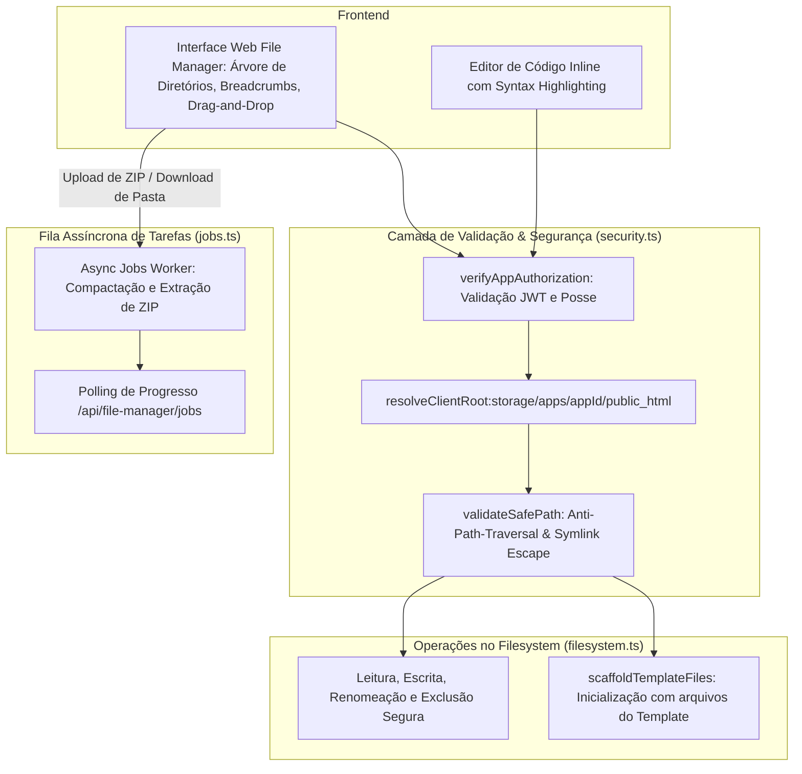

# Gerenciador de Arquivos Web (File Manager)

O **Web File Manager** integrado ao Painel EQSAM é uma solução de gerenciamento de arquivos de alto desempenho desenvolvida para substituir com vantagens o FTP/SFTP tradicional diretamente no navegador.

Ele permite que clientes e operadores inspecionem, criem, editem, façam upload, baixem e manipulem arquivos do contêiner com segurança militar e isolamento estrito via **Chroot Sandbox**.

---

## 🏗️ Arquitetura do Módulo de Arquivos

O subsistema reside em `src/lib/file-manager/` e divide-se em cinco componentes fundamentais:

---

## 🔒 Camadas de Segurança e Isolamento

Cada aplicação possui uma raiz física canônica e dedicada no sistema de arquivos:
`storage/apps/{appId}/public_html/`

### Proteções Ativas:
1. **Bloqueio de Path Traversal:** Todas as rotas de arquivo passam por `validateSafePath()`, que intercepta qualquer tentativa de injeção de caracteres de controle (`\0`), barras invertidas malformadas ou sequências `..` para tentar acessar o sistema operacional host.
2. **Prevenção de Symlink Escape:** Se um link simbólico dentro do diretório do cliente apontar para um arquivo fora do sandbox (ex: `/etc/shadow`), o motor detecta a quebra de fronteira via `fs.realpath()` e bloqueia a operação imediatamente.
3. **Sincronização com o Docker Swarm:** Na primeira abertura ou após alterações, a função `pullRealFilesFromSwarm()` sincroniza os arquivos reais do volume do contêiner para o diretório local do File Manager.

---

## ⚡ Recursos e Capacidades da Interface

### 1. Navegação e Árvore de Diretórios
- **Barra de Navegação por Trilha (Breadcrumbs):** Caminho interativo clicável (`/ > public_html > src > config`).
- **Listagem Rápida:** Exibição do tipo de arquivo, tamanho formatado (B, KB, MB, GB), permissões UNIX e data de última modificação.
- **Filtros e Busca em Tempo Real:** Localização instantânea de arquivos por nome ou extensão.

### 2. Editor de Código Inline
- Suporte a edição direta de arquivos de texto, configurações e código-fonte (`.html`, `.css`, `.js`, `.ts`, `.json`, `.env`, `.php`, `.py`, `.yaml`).
- Destaque de sintaxe colorido (Syntax Highlighting) com tema escuro consistente com o restante do painel.
- Atalhos de teclado (ex: `Ctrl + S` / `Cmd + S` para salvar instantaneamente sem recarregar a página).

### 3. Upload por Arrastar e Soltar (Drag & Drop)
- Envio simultâneo de múltiplos arquivos diretamente pela área de trabalho.
- Barra de progresso individual por arquivo e tratamento de cancelamento.
- Verificação de quota de disco antes de iniciar a gravação física.

### 4. Fila Assíncrona de ZIP (Async Job Worker)
Compactar ou descompactar arquivos pesados (ex: instalações do WordPress de 500MB) através de uma requisição HTTP síncrona causa travamentos no navegador ou timeout no proxy. O Painel EQSAM resolve isso através de **Tarefas em Background (Jobs)**:
- Ao solicitar "Extrair Arquivo" ou "Baixar Pasta como ZIP", um ID de tarefa (`jobId`) é gerado.
- Um worker independente executa a operação via streams de baixa latência em segundo plano.
- O usuário visualiza uma barra de progresso em tempo real e é notificado via toast no momento exato da conclusão.
