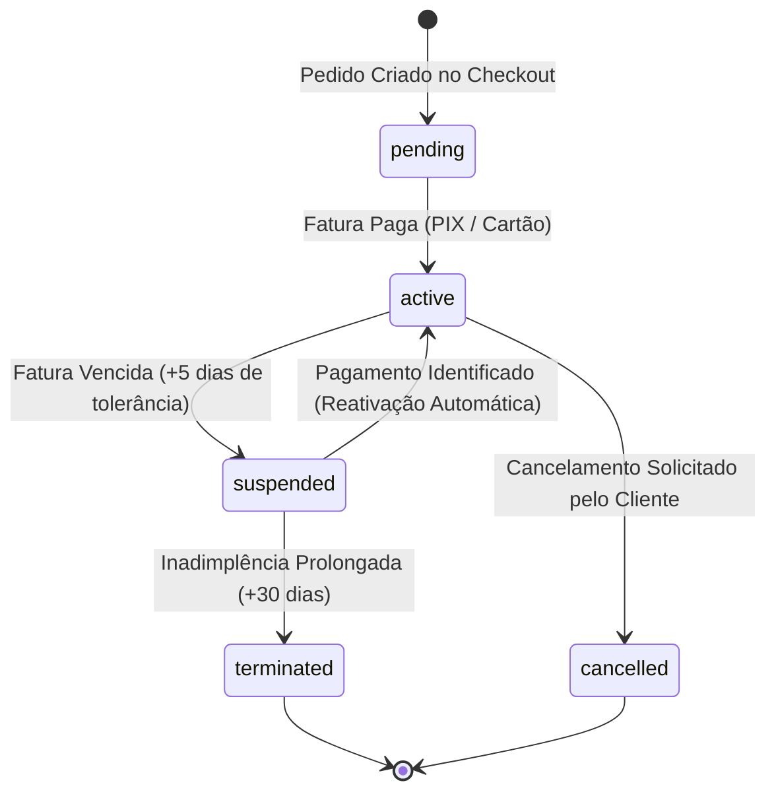

# Gerenciamento de Serviços

O módulo de serviços (`/services` e `/services/$serviceId`) gerencia o ciclo de vida completo de cada assinatura contratada pelo cliente, integrando provisionamento automatizado, controle de recursos e sincronização com provedores externos de infraestrutura.

---

## 🔄 Ciclo de Vida de um Serviço

Cada assinatura percorre uma máquina de estados estrita no banco de dados (`public.service_status`):

### Detalhamento dos Estados:
1. **`pending` (Pendente):** O serviço foi registrado, mas aguarda a confirmação de pagamento da fatura de abertura para iniciar o provisionamento físico dos contêineres ou contas.
2. **`active` (Ativo):** Totalmente operacional, com recursos alocados no cluster ou provedor e acessível para o usuário.
3. **`suspended` (Suspenso):** Os contêineres são pausados ou o acesso SSH/painel é bloqueado por inadimplência. Os dados e arquivos são preservados integralmente.
4. **`terminated` (Encerrado):** Os recursos foram destruídos permanentemente no cluster após o período limite de retenção.
5. **`cancelled` (Cancelado):** Cancelamento voluntário solicitado pelo titular.

---

## 📦 Tipos de Serviços Suportados

A fábrica de provedores (`src/lib/hosting-provider-factory.server.ts`) abstrai a comunicação com diferentes classes de serviços:

| Categoria do Serviço | Provedor / Motor Técnico | Capacidades e Ações do Painel |
| :--- | :--- | :--- |
| **Cloud Apps (PaaS)** | Docker Swarm Direto | Deploy de contêineres, controle de réplicas, subdomínio automático, File Manager e monitoramento. |
| **Hospedagem Web** | DirectAdmin Provider | Criação de contas de hospedagem cPanel/DirectAdmin, gestão de caixas postais, zonas DNS e bancos MySQL. |
| **Servidores VPS** | Contabo / SSH Provider | Máquinas virtuais dedicadas com controle de energia (Ligar, Desligar, Reiniciar), console VNC e reinstalação de SO. |

---

## 🔍 Painel Detalhado do Serviço (`/services/$serviceId`)

Ao clicar em um serviço, o cliente tem acesso à visão detalhada:

- **Especificações Contratadas:** Exibição clara de núcleos de CPU, Memória RAM contratada, Espaço em Disco (SSD/NVMe) e largura de banda.
- **Dados de Conexão e Acesso:** IP do servidor designado, porta de conexão, usuário mestre e botão para revelar ou redefinir senhas com segurança.
- **Ciclo de Faturamento & Próximo Vencimento:** Periodicidade contratada (Mensal, Trimestral, Anual), valor de renovação e data exata da próxima fatura.
- **Ações de Controle:**
  - *Acessar Painel / Console*: Acesso direto com SSO ou credenciais.
  - *Mudar Senha de Acesso*: Alteração criptografada disparada diretamente via API do provedor.
  - *Solicitar Cancelamento*: Abertura guiada com opção de encerramento imediato ou no final do ciclo pago.
