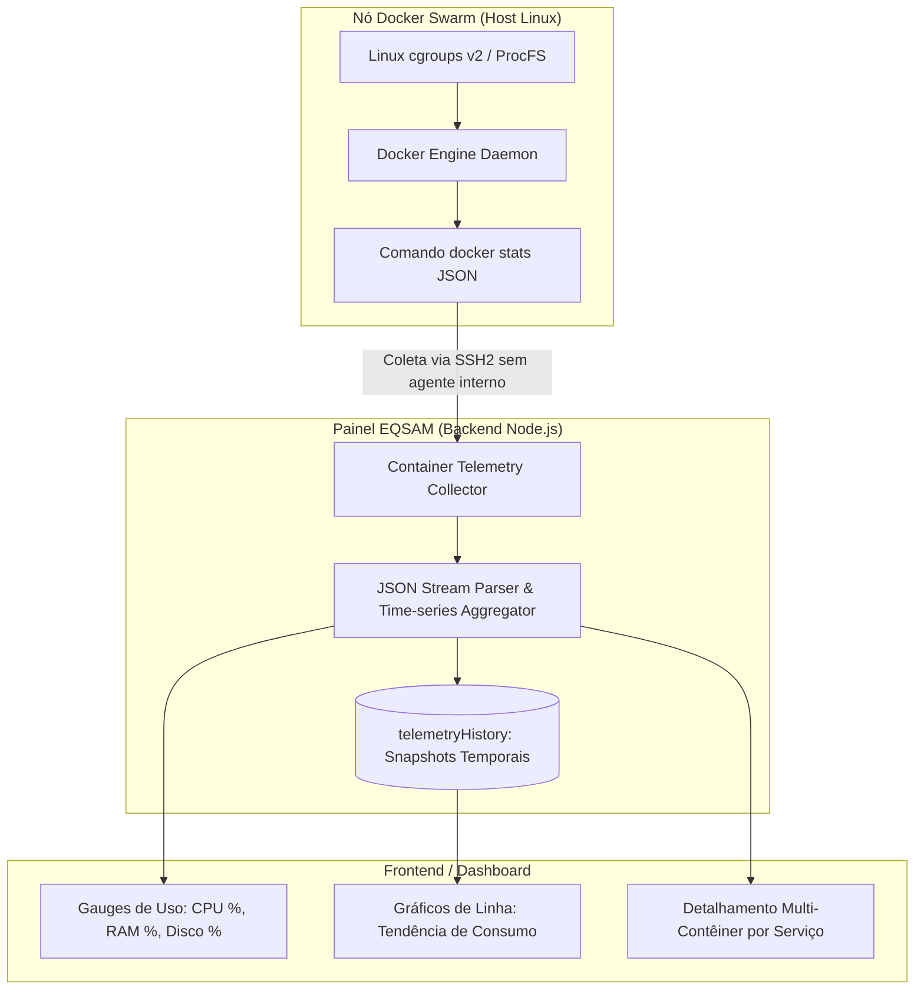

# Monitoramento & Telemetria em Tempo Real

O subsistema de observabilidade do **Painel EQSAM** (`src/lib/container-telemetry.server.ts`) transforma dados brutos do kernel do Linux e do runtime do Docker em métricas legíveis, gráficos temporais e diagnósticos preditivos de infraestrutura.

---

## 📡 Como a Telemetria é Coletada

Diferente de abordagens tradicionais que exigem a instalação de agentes pesados (como Datadog ou New Relic) dentro do contêiner do cliente — consumindo recursos preciosos de CPU e memória —, o Painel EQSAM adota **coleta passiva no host via SSH**:

---

## 📊 Estrutura de Métricas (`LiveContainerMetrics`)

A cada ciclo de telemetria, o painel processa a seguinte estrutura consolidada:

| Campo da Métrica | Tipo / Formato | Descrição Técnica |
| :--- | :--- | :--- |
| **`cpuUsagePercent`** | `number` (ex: `14.2%`) | Percentual de utilização dos núcleos de CPU atribuídos. |
| **`cpuStatus`** | `idle` / `stable` / `high` / `critical` | Classificação de estresse do processador. |
| **`usedRamMb` / `totalRamMb`** | `number` (ex: `384 / 1024 MB`) | Memória RAM real consumida versus o limite da cota contratada. |
| **`ramUsagePercent`** | `number` (ex: `37.5%`) | Porcentagem de ocupação da memória física. |
| **`usedDiskFormatted`** | `string` (ex: `1.45 GB`) | Espaço físico em disco ocupado pela imagem, camadas e volume persistente. |
| **`diskUsagePercent`** | `number` (ex: `48.3%`) | Proporção de disco consumido contra a cota do plano (+ margem de 20%). |
| **`uptimeFormatted`** | `string` (ex: `14d 6h 22m`) | Tempo ininterrupto de atividade do contêiner sem reinicializações. |
| **`networkInKb` / `networkOutKb`** | `number` | Volume de dados trafegados através das interfaces de rede virtuais. |
| **`pids`** | `number` | Contagem de threads e processos ativos no contêiner (detecção de forks maliciosos). |

---

## 📈 Histórico Temporal & Detalhamento Multi-Contêiner

### 1. Gráficos de Tendência Histórica (`telemetryHistory`)
Os últimos pontos de coleta são mantidos em uma série temporal de snapshots, permitindo aos usuários identificar:
- Picos de tráfego repentinos.
- Padrões cíclicos (ex: consumo de CPU elevado sempre às 03:00 da manhã devido a rotinas de backup).
- Vazamentos de memória (*memory leaks*) onde o consumo de RAM cresce continuamente sem retornar à linha de base.

### 2. Decomposição de Stacks Multi-Contêiner (`containerBreakdown`)
Para stacks compostas por múltiplos serviços (por exemplo, WordPress + MySQL ou OpenStatus + Turso DB), o painel decompõe o consumo individualmente:
- Exibe quanto de RAM e CPU cada contêiner específico está utilizando.
- Facilita a identificação de qual serviço é o vilão do consumo de memória.

---

## 🚨 Diagnósticos Proativos e Alertas de Upgrade

O motor analisa continuamente as métricas para proteger as aplicações contra panes por **OOM (Out Of Memory Kill)** ou **Disk Full**:

- **Alerta de Memória (> 85% por mais de 5 minutos):**
  - O sistema sinaliza o estado como `high` ou `critical`.
  - `shouldUpgrade: true` é acionado com a recomendação técnica: *"A aplicação está próxima do limite de memória RAM contratado. Faça o upgrade do plano para evitar encerramento forçado do processo pelo kernel."*
- **Alerta de Disco (> 90%):**
  - O painel exibe um banner de alerta urgente sugerindo a limpeza de logs ou expansão do armazenamento antes que novos arquivos sejam corrompidos.
