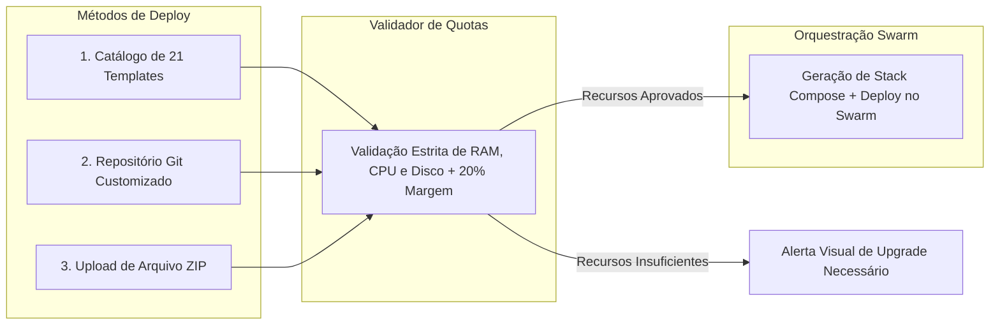

# PaaS: Aplicações Cloud & Bots

O módulo **Cloud Apps (PaaS)** (`/apps`, `/apps/create` e `/apps/$appId`) é o coração operacional da plataforma EQSAM, permitindo que desenvolvedores provisionem, configurem e gerenciem microsserviços, bots de WhatsApp/Discord e sistemas complexos em questão de segundos sobre o **Docker Swarm**.

---

## 🚀 Métodos de Criação de Aplicações

Ao acessar `/apps/create`, o usuário escolhe entre três abordagens flexíveis:



### 1. Catálogo de 21 Templates em 1-Clique
Pré-configurações otimizadas para as aplicações mais utilizadas do ecossistema moderno:
- **Websites & CMS:** Site Estático HTTP/3 (Caddy), WordPress + MySQL, Next.js / React SSR, Ghost CMS.
- **Linguagens & Stacks:** PHP 8.3 / Laravel, Python (Django & Flask), Go / Golang (Fiber & Gin), Java 21 / Spring Boot 3, Rust (Actix & Axum).
- **Bots & Atendimento:** Evolution API (WhatsApp), Discord.js Bot Starter, Typebot Viewer.
- **Automações & Ferramentas:** N8N Workflow Automation, Uptime Kuma, OpenStatus Monitor.
- **APIs & Backends:** Fastify REST API, Python FastAPI.
- **Bancos de Dados:** PostgreSQL, MySQL, Redis Standalone, PocketBase.

### 2. Repositório Git Customizado
- Conexão com qualquer repositório Git público ou privado via SSH Key / Personal Access Token.
- Seleção da branch de deploy (ex: `main`, `master`, `production`).
- Seleção do Build Pack: **Nixpacks** (detecção automática de linguagem e dependências), **Dockerfile** nativo, **Docker Compose** multi-contêiner ou **Static** (Caddy/Nginx).

### 3. Upload de Pacote ZIP
- Envio direto do arquivo ZIP contendo o código-fonte da aplicação através do navegador.
- Descompactação automática no sandbox da aplicação e inicialização imediata.

---

## 🛡️ Validação Estrita de Disco e Margem de Segurança de 20%

Para evitar incidentes críticos onde contêineres entram em looping de reinicialização ou travam por falta de espaço durante a escrita de logs, caches temporários ou bancos de dados locais, o painel implementa a **validação estrita com 20% de margem de segurança**:

### A Fórmula de Quota:
```typescript
export const DISK_SAFETY_MARGIN_PERCENT = 20;

export function getRequiredDiskWithMargin(recommendedDiskMb?: number): number {
  if (!recommendedDiskMb || recommendedDiskMb <= 0) return 512;
  return Math.ceil(recommendedDiskMb * (1 + DISK_SAFETY_MARGIN_PERCENT / 100));
}
```

### Como a Regra Atua:
1. **No Catálogo de Templates (`/apps/create`):** Cada template exibe sua exigência mínima de disco (ex: OpenStatus exige 7.168 MB base; com a margem de 20%, o plano precisa dispor de no mínimo **8.602 MB** de quota). Templates incompatíveis com o plano atual do cliente são desabilitados com um aviso explicativo.
2. **Na Edição e Aplicação do Template (`applyTemplateToApplication`):** Caso o usuário tente forçar um template cujo disco exceda a quota do serviço (`service.disk_mb`), o backend rejeita a operação com erro detalhado `400 Bad Request`.
3. **No Dashboard da Aplicação (`/apps/$appId`):** Indicadores visuais alertam proativamente se a aplicação estiver operando próxima ao limite (`underpowered warning`), recomendando o redimensionamento antes que ocorra lentidão.

---

## ⚙️ Ações e Ciclo de Vida da Aplicação (`/apps/$appId`)

Na tela de gerenciamento individual da aplicação, o usuário tem acesso às seguintes abas e controles:

1. **Visão Geral (Overview):**
   - Status em tempo real das réplicas (`1/1 Online` com ponto esmeralda pulsante).
   - URL primária com certificado SSL ativo e subdomínio do sistema (ex: `meuapp.dk1.eqsam.com`).
   - Botões de ação direta: **Reiniciar (Restart)**, **Parar (Stop)**, **Reconstruir (Rebuild)** e **Excluir (Delete)**.
2. **Terminal de Logs em Tempo Real (Logs):**
   - Transmissão contínua de logs capturados do serviço no Swarm via SSH (`docker service logs -f --tail 200`).
   - Recursos de pausar auto-scroll, limpar tela e copiar logs para depuração.
3. **Variáveis de Ambiente (Envs):**
   - Editor de pares Chave/Valor com suporte a injeção em tempo de build ou execução e gerador de segredos.
4. **Gerenciador de Arquivos (File Manager):**
   - Acesso embutido à árvore física de arquivos da aplicação.
5. **Domínios & Rede:**
   - Adição de domínios próprios e validação instantânea de apontamento DNS.
6. **Configurações Avançadas:**
   - Alteração de porta interna exposta pelo contêiner, comando customizado de inicialização (`command` / `entrypoint`) e limites de memória/CPU.
