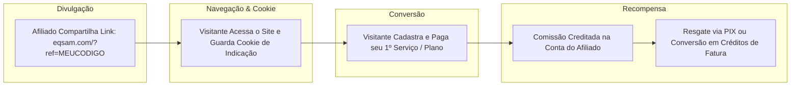

# Programa de Afiliados & Comissões

O módulo de afiliados (`/affiliates`) transforma os usuários do **Painel EQSAM** em promotores ativos da marca, recompensando indicações bem-sucedidas com comissões automáticas depositadas em carteira ou resgatáveis via PIX.

---

## 🎯 Como Funciona o Programa de Indicação

---

## ⚙️ Regras de Comissionamento & Rastreamento

1. **Link de Indicação Exclusivo:** Cada usuário possui um código alfanumérico único associado à sua conta (ex: `https://painel.eqsam.com/auth?ref=jhona123`).
2. **Janela de Rastreamento por Cookie:** Quando um visitante clica no link de afiliado, um cookie seguro de persistência (com validade de 30 a 90 dias) é registrado em seu navegador. Se o cadastro for concluído em qualquer momento dentro desse período, a indicação é atribuída ao afiliado.
3. **Modelos de Comissão:**
   - **Comissão Percentual (ex: 15% a 20%):** Calculada dinamicamente sobre o valor líquido pago na fatura de cada serviço contratado pelo indicado.
   - **Comissão Recorrente:** O afiliado continua recebendo comissões a cada renovação mensal ou anual daquele serviço, enquanto o cliente indicado mantiver a assinatura ativa.

---

## 💰 Painel de Controle do Afiliado

Na rota `/affiliates`, o cliente acompanha sua performance em tempo real:

- **Contador de Cliques:** Quantidade total de visitantes únicos que chegaram através do seu link.
- **Cadastros Convertidos:** Total de novos clientes que criaram conta com seu código.
- **Serviços Ativos Gerando Renda:** Quantidade de assinaturas pagas em vigor originadas por sua rede.
- **Saldo Disponível:** Valor acumulado liberado para saque imediato.
- **Saldo Pendente:** Comissões em período de garantia/carência (ex: 7 dias de tolerância da fatura).

---

## 💸 Solicitação e Processamento de Saques

Ao atingir o valor mínimo estipulado (ex: R$ 50,00):
1. O afiliado clica em **"Solicitar Saque"**.
2. Informa sua **Chave PIX** (CPF, CNPJ, E-mail, Telefone ou Chave Aleatória).
3. Uma solicitação é registrada no módulo administrativo (`/admin/affiliates`) para conferência e liquidação bancária, ou o valor pode ser convertido opcionalmente em créditos de carteira (`/wallet`) com 1-clique sem taxas.
