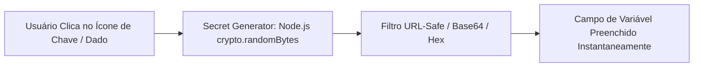

# Variáveis de Ambiente & Gerador de Segredos

O gerenciamento de configurações no **Painel EQSAM** segue rigorosamente a metodologia dos **Doze Fatores (12-Factor App)**, garantindo a estrita separação entre o código da aplicação e suas credenciais de execução.

---

## 🔑 Tipos de Variáveis Suportadas

Na aba **Variáveis de Ambiente** de cada aplicação, os clientes podem definir dois escopos de configuração:

1. **Variáveis de Execução (Runtime Envs):**
   - Injetadas diretamente no contêiner durante a inicialização do serviço no Docker Swarm.
   - Exemplos: `PORT=3000`, `NODE_ENV=production`, `DATABASE_URL=postgres://...`.
2. **Variáveis de Compilação (Build-Time Envs):**
   - Disponibilizadas durante o processo de empacotamento com Nixpacks ou Dockerfile (`ARG` / build cache).
   - Exemplos: `NEXT_PUBLIC_API_URL=https://api.meusite.com`, `VITE_APP_TITLE=Meu App`.

---

## 🎲 Gerador Criptográfico de Segredos Integrado

Para evitar que usuários utilizem senhas fracas ou previsíveis (como `123456` ou `admin`), o painel possui um utilitário nativo de geração criptográfica de alta entropia (`src/lib/secret-generator.ts`):

### Perfis de Geração Pré-Configurados:
- **Chave de Criptografia AES (32 bytes / 256 bits):** Ideal para `ENCRYPTION_KEY`, `N8N_ENCRYPTION_KEY`, `TYPEBOT_ENCRYPTION_SECRET`.
- **Token JWT / Auth Secret (64 caracteres hexadecimais):** Perfeito para `NEXTAUTH_SECRET`, `AUTH_SECRET`, `JWT_SECRET`.
- **Senha Segura de Banco de Dados:** Mistura equilibrada de letras maiúsculas, minúsculas, números e caracteres especiais sem pontuações que quebrem URIs (`!`, `#`, `%`).
- **Chave de API / Webhook Secret:** Sequência alfanumérica segura para autenticação header-to-header.

---

## 📋 Importação e Exportação em Formato `.env`

Além do editor visual linha a linha, o módulo suporta:
- **Importação Rápida (Raw Paste):** Permite colar o conteúdo completo de um arquivo `.env` existente; o parser do sistema separa chaves, valores e remove aspas automaticamente.
- **Exportação Segura:** Botão para copiar todas as variáveis em formato `.env` para backup ou replicação em ambiente de desenvolvimento local.
- **Mascaramento Visual:** Por padrão, todos os valores são ocultados com caracteres de senha (`••••••••`). O botão de visualização (`Eye`) permite inspecionar ou copiar valores específicos sem revelá-los em capturas de tela acidentais.
