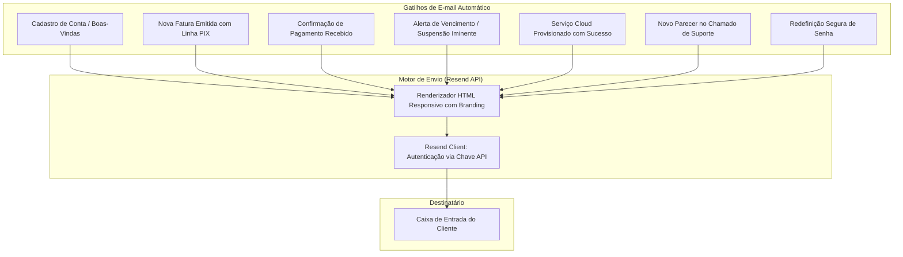
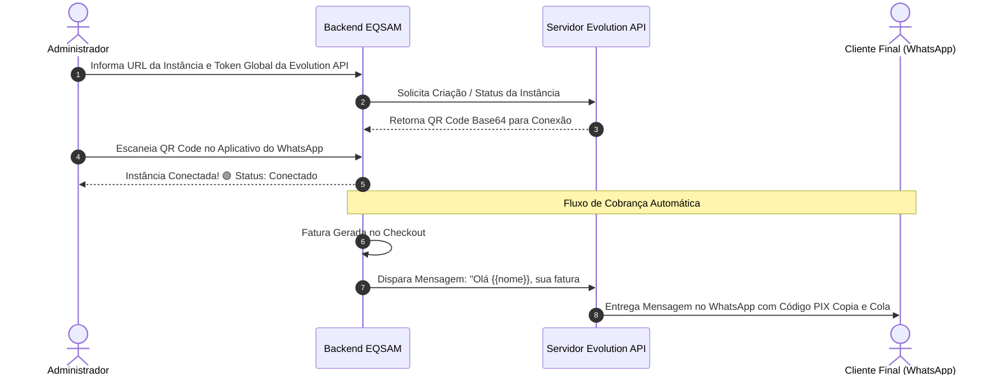

# Automações: Resend Email & WhatsApp API

O módulo de comunicação (`/admin/emails` e `/admin/whatsapp`) automatiza toda a régua de relacionamento, cobrança e suporte do **Painel EQSAM** através de dois canais de alta entregabilidade: **Resend (E-mail Transacional)** e **Evolution API (WhatsApp Bot)**.

---

## 📧 Automação de E-mails com Resend

O sistema integra nativamente a API do **Resend** (`src/lib/emails.server.ts`), proporcionando entregabilidade na caixa de entrada (inbox) e suporte a DKIM, SPF e DMARC:

### Configurações Disponíveis em `/admin/emails`:
- **Chave de API do Resend:** Campo seguro para inserção do token `re_...`.
- **E-mail do Remetente Oficial:** Endereço verificado no domínio da empresa (ex: `financeiro@suaempresa.com.br`).
- **Nome de Exibição:** Nome amigável que aparece para o cliente (ex: `Sua Marca Cloud`).
- **Editor de Modelos:** Visualização e ajuste do conteúdo de cada template transacional.

---

## 📱 Integração WhatsApp com Evolution API

Para o mercado brasileiro, onde o WhatsApp é o canal prioritário de comunicação e vendas, o painel oferece conexão nativa com a **Evolution API** (`/admin/whatsapp`):

### Recursos de Mensageria do WhatsApp:
- **Variáveis Dinâmicas nos Textos:**
  - `{{nome}}`: Primeiro nome do cliente.
  - `{{valor}}`: Valor formatado em reais (ex: `R$ 49,90`).
  - `{{vencimento}}`: Data limite para quitação.
  - `{{pix_copia_cola}}`: Código puro para o cliente copiar e colar diretamente no app bancário.
  - `{{link_fatura}}`: URL curta para abertura da fatura online.
- **Régua de Notificações Automáticas:**
  1. *Fatura Gerada:* Disparo no segundo em que o pedido é realizado.
  2. *Lembrete de Vencimento:* Disparo na manhã do dia do vencimento.
  3. *Aviso de Tolerância:* Alerta 24 horas antes do bloqueio preventivo do contêiner.
  4. *Comprovante de Pagamento:* Mensagem instantânea de agradecimento assim que o webhook do PIX confirma a transação.
