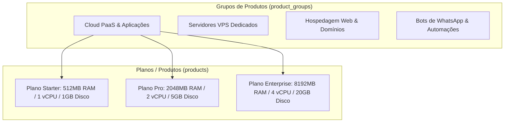

# Catálogo de Produtos & Grupos

O módulo de catálogo (`/admin/products` e `/admin/product-groups`) gerencia o portfólio comercial de serviços ofertados pelo **Painel EQSAM**, estruturando grupos de categorias, limites técnicos de hardware e precificação multi-ciclo.

---

## 🏷️ Estrutura de Grupos de Produtos (`product_groups`)

Os grupos organizam a vitrine comercial da plataforma:

### Configurações do Grupo:
- **Nome & Ícone:** Identificação visual na barra de navegação e página de planos (`/plans`).
- **Ordem de Exibição:** Priorização visual na vitrine de vendas.
- **Visibilidade:** Grupos públicos para novos clientes ou grupos ocultos/privados exclusivos para revendedores ou clientes sob medida.

---

## 💎 Configuração de Planos e Produtos (`products`)

Cada produto combina características comerciais e restrições de computação:

### 1. Limites e Cotas de Hardware:
- **`cpu_cores`:** Quantidade de núcleos virtuais de processador atribuídos ao serviço.
- **`ram_mb`:** Limite de memória física (ex: `512`, `1024`, `2048`, `4096`, `8192` MB). Utilizado pelo Docker Swarm para impor limites estritos de `limits.memory` e `reservations.memory`.
- **`disk_mb`:** Limite de armazenamento persistente. Aplicado na validação de templates e no monitoramento de telemetria.

### 2. Matriz de Faturamento Multi-Ciclo:
O painel suporta descontos progressivos para ciclos de fidelidade mais longos:
- **Mensal:** Preço base sem desconto (ex: R$ 29,90/mês).
- **Trimestral:** Desconto de 5% a 10% (ex: R$ 80,70 a cada 3 meses).
- **Semestral:** Desconto de 15% (ex: R$ 152,40 a cada 6 meses).
- **Anual:** Desconto de 20% a 25% com pagamento unificado (ex: R$ 287,00/ano).
- **Bienal:** Desconto agressivo para contratos de 2 anos.

### 3. Automação de Provisionamento Imediato:
- Ao vincular o produto a um módulo provedor (ex: `Docker Swarm PaaS`, `DirectAdmin` ou `Contabo`), o sistema dispara o fluxo de criação técnica no segundo em que a fatura inicial atinge o status `paid`.
- O cliente recebe imediatamente por e-mail e na tela de confirmação os links e dados de acesso.
