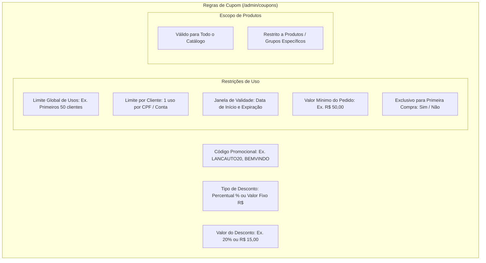

# Cupons de Desconto & Campanhas

O módulo de cupons (`/admin/coupons`) permite a criação de campanhas de marketing direcionadas, descontos sazonais e incentivos de conversão no checkout do **Painel EQSAM**.

---

## 🎟️ Parâmetros de Configuração de um Cupom

Ao criar um novo cupom de desconto, o administrador pode parametrizar regras refinadas de aplicação:

---

## 💳 Aplicação e Validação no Checkout

Durante o processo de contratação em `/checkout`:
1. **Validação Instantânea:** Ao digitar o código e clicar em "Aplicar", o backend valida em tempo real se o cupom:
   - Existe e está com status ativo.
   - Encontra-se dentro da janela de vigência.
   - Não excedeu o limite global de usos.
   - Ainda não foi utilizado pelo usuário logado.
   - É compatível com o produto selecionado no carrinho.
2. **Cálculo Transparente:** O resumo do pedido atualiza imediatamente exibindo:
   - Subtotal Original.
   - Linha de Desconto Promocional (`- R$ 20,00` ou `- 15%`).
   - Total Final a Pagar via PIX ou Cartão.
3. **Controle de Concorrência e Idempotência:** A contagem de usos do cupom só é consumida no momento da confirmação bancária da fatura, prevenindo que cupons sejam perdidos caso o cliente abandone o checkout antes do pagamento.
