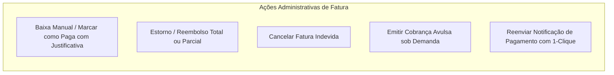

# Faturamento Global & Conciliação

O módulo financeiro administrativo (`/admin/invoices` e `/admin/finance`) fornece controle irrestrito sobre as transações de receitas, faturas emitidas, conciliações bancárias e exportações contábeis do **Painel EQSAM**.

---

## 📑 Gestão de Faturas Globais

A visão administrativa de faturas consolida todas as cobranças emitidas no sistema com filtros de busca avançados:
- **Filtros por Estado:** `pending`, `paid`, `overdue`, `cancelled`, `refunded`.
- **Filtro por Cliente:** Busca instantânea por nome, e-mail ou CPF/CNPJ.
- **Filtro por Intervalo Temporal:** Vencimentos da semana, pagamentos do mês ou relatórios anuais.
- **Filtro por Gateway:** Segregação entre transações CajuPay, MercadoPago, Asaas ou saldo de carteira.

---

## 🛠️ Ações Operacionais do Administrador

### 1. Baixa Manual de Fatura (Conciliação Externa)
Se um cliente realizar transferência bancária direta (TED/DOC) ou depósito em conta corporativa fora do gateway automatizado:
- O operador clica em **"Dar Baixa Manual"**.
- Insere a data da compensação, o código do comprovante e observações de auditoria.
- A fatura migra para o estado `paid` e todos os serviços vinculados são ativados automaticamente.

### 2. Emissão de Fatura Avulsa sob Demanda
Para cobranças de serviços personalizados (ex: consultoria de migração de servidor, desenvolvimento de bot sob medida ou acréscimo de blocos de IP dedicado):
- O operador seleciona o cliente, define o título dos itens, valor e data de vencimento.
- A fatura é gerada instantaneamente e notificada ao cliente por e-mail e WhatsApp.

### 3. Reenvio Rápido de Notificações
Com apenas 1-clique, o administrador pode reenviar o e-mail oficial de cobrança ou disparar uma mensagem no WhatsApp do cliente com o código PIX Copia e Cola atualizado.

---

## 📊 Relatórios e Exportação Contábil (CSV / ERP)

Para prestação de contas fiscais e alimentação de softwares contábeis externos (ContaAzul, Omie, Bling):
- O sistema permite exportar a listagem completa de faturas em formato **CSV padronizado** (`src/lib/csv.ts`).
- Colunas incluídas: ID da Fatura, Nome do Cliente, Documento Fiscal, Data de Emissão, Data de Vencimento, Data de Pagamento, Valor Bruto, Taxa do Gateway, Valor Líquido e Forma de Liquidação.
