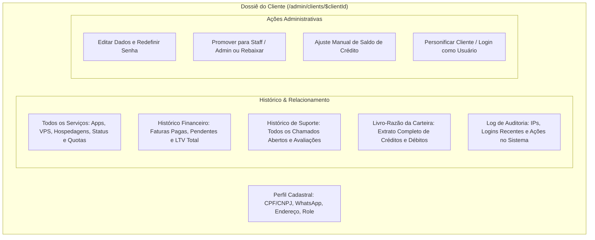

# Gestão de Clientes & Impersonação

O módulo de clientes (`/admin/clients` e `/admin/clients/$clientId`) centraliza o gerenciamento do ciclo de vida dos usuários, a emissão de relatórios completos (Dossiê do Cliente) e a poderosa ferramenta de **Impersonação de Sessão (Login como Cliente)** para suporte de nível avançado.

---

## 🗂️ Dossiê Completo do Cliente (Client Dossier)

Ao acessar a ficha detalhada de qualquer cliente (`src/lib/client-dossier.server.ts`), o operador visualiza um raio-X completo em 360 graus:



---

## 🎭 Impersonação de Clientes (Login Como Cliente)

A impersonação é uma das ferramentas mais críticas para equipes de suporte e atendimento de alto nível. Ela permite que um administrador ou técnico **acesse o painel exatamente com a visão e permissões daquele cliente**, sem jamais precisar solicitar, alterar ou conhecer a senha pessoal do usuário.

### Como Funciona a Mecânica Técnica:
1. **Autorização:** Apenas operadores com permissão de `admin` podem disparar a ação.
2. **Troca Segura de Contexto:** O backend emite uma sessão temporária de impersonação com metadados adicionais (`is_impersonating: true` e `original_admin_id: <admin_uuid>`).
3. **Trilha de Auditoria Obrigatória:** Toda personificação gera imediatamente um registro indelével na tabela `public.audit_logs`:
   - Quem personificou (`admin_id`).
   - Quem foi personificado (`client_id`).
   - IP de origem e User-Agent do administrador.
   - Timestamp com precisão de milissegundos.
4. **Banner Superior Flutuante:** Enquanto estiver personificando o cliente, uma barra fixa com fundo vibrante e aviso claro é exibida no topo de todas as páginas:
   ```text
   ⚠️ ATENÇÃO: Você está navegando como [Nome do Cliente] ([Email]) | [Sair da Personificação e Voltar ao Admin]
   ```
5. **Retorno Seguro:** Ao clicar em "Sair da Personificação", o token temporário é revogado e o administrador é reconduzido instantaneamente ao painel administrativo.

---

## ⚙️ Ações e Controles Administrativos de Conta

- **Alteração Granular de Papel (Role):** Transição entre `client`, `staff` e `admin` com aplicação imediata nas políticas RLS do banco de dados.
- **Bloqueio Cautelar de Conta:** Capacidade de congelar a conta de um usuário suspeito de fraude ou envio de spam, suspendendo instantaneamente todos os seus serviços e contêineres no cluster.
- **Ajuste Manual de Carteira:** Adicionar créditos de cortesia ou bonificação com inserção de justificativa formal auditável.
