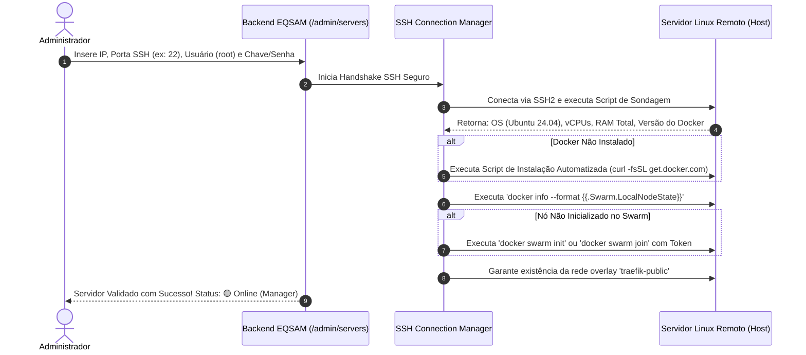

# Gestão de Servidores & Cluster Swarm

O módulo de servidores (`/admin/servers`) é a central de comando da infraestrutura física e virtual do **Painel EQSAM**, permitindo cadastrar, auditar, monitorar e orquestrar múltiplos nós de computação integrados ao **Docker Swarm**.

---

## 🖥️ Cadastro e Validação de Novos Nós

Para incorporar um novo servidor (seja uma VPS Contabo, Hetzner, AWS ou máquina Bare-Metal própria) ao ecossistema EQSAM:

---

## 🧭 Papéis dos Nós no Swarm (Manager vs. Worker)

Cada máquina adicionada desempenha uma função específica na topologia do cluster:

1. **Nós Manager (Gerenciadores):**
   - Mantêm o estado distribuído do cluster utilizando o algoritmo de consenso **Raft**.
   - Recebem comandos de criação, atualização e exclusão de stacks (`docker stack deploy`).
   - Hospedam instâncias do **Traefik Ingress** e monitoram a saúde global dos nós.
2. **Nós Worker (Trabalhadores):**
   - Executam contêineres de clientes (aplicações web, bancos de dados, bots) de acordo com a distribuição de carga definida pelo agendador do Swarm.
   - Não possuem permissão para alterar a topologia ou o estado de outros nós, garantindo isolamento caso um contêiner sofra comprometimento.

---

## 🎛️ Modos de Disponibilidade do Nó (Drain, Pause & Active)

Antes de reiniciar ou desligar um servidor físico para atualizações de kernel do Linux, o administrador pode alterar o estado do nó no painel com 1-clique:

- **`active` (Ativo):** O agendador aloca novas tarefas e contêineres normalmente no nó.
- **`pause` (Pausado):** Os contêineres atuais continuam executando, mas nenhuma nova réplica é agendada nesta máquina.
- **`drain` (Drenagem / Manutenção Segura):**
  - **Zero Downtime:** Todos os contêineres e tarefas em execução neste nó são imediatamente migrados para os demais servidores saudáveis do cluster.
  - O nó fica completamente livre de carga, permitindo que a manutenção física seja executada sem derrubar nenhum site ou bot de cliente.
  - Ao concluir a manutenção, basta retornar a disponibilidade para `active`.

---

## 🩺 Monitoramento de Saúde e Telemetria Global

A tabela de servidores exibe em tempo real:
- **Ping / Latência SSH:** Tempo de resposta do handshake de rede em milissegundos.
- **Utilização de Memória RAM:** Barra de progresso visual com consumo atual e capacidade total (ex: `12.4 GB / 32 GB - 38%`).
- **Carga de CPU (Load Average):** Carga do processador em 1, 5 e 15 minutos.
- **Armazenamento:** Espaço em disco particionado em `/` e `/var/lib/docker`.
- **Status do Circuit Breaker:** Indicador verde (`CLOSED`), amarelo (`HALF_OPEN`) ou vermelho (`OPEN`).
