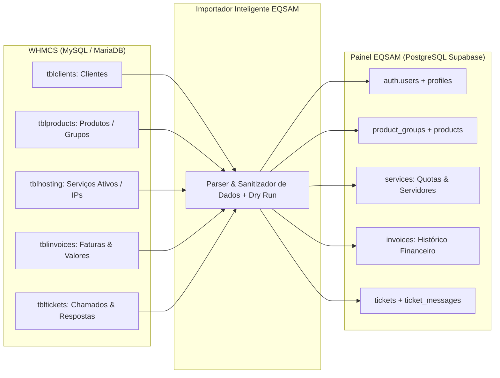

# Importador Legado WHMCS

O módulo de migração (`/admin/import`) foi desenvolvido especificamente para empresas e provedores que utilizam a plataforma legada **WHMCS** e desejam migrar toda a sua base de clientes, serviços, faturas e chamados para a arquitetura moderna do **Painel EQSAM** com **zero perda de dados e transição suave**.

---

## 📦 Entidades Migradas do WHMCS

O importador realiza a conversão automática do modelo relacional clássico do WHMCS para a estrutura do PostgreSQL / Supabase:

---

## 🛠️ Modos de Importação Disponíveis

### 1. Conexão Direta ao Banco MySQL (Recomendado)
- O operador insere as credenciais do banco MySQL do WHMCS (Host, Porta, Usuário, Senha e Nome do Banco).
- O backend realiza uma conexão somente-leitura (`SELECT`) e extrai as tabelas necessárias de forma paginada para não sobrecarregar a memória do servidor de origem.

### 2. Upload de Arquivo de Dump (JSON / SQL)
- Caso o banco de dados do WHMCS esteja isolado ou inacessível externamente, o operador pode exportar as tabelas em formato JSON ou script SQL e fazer o upload do arquivo diretamente no painel.

---

## 🛡️ Modos de Segurança: Pré-Validação (Dry-Run) & Senhas

Para garantir que nenhuma inconsistência afete a integridade do banco de produção:

1. **Modo Simulação (Dry-Run):**
   - O importador processa todo o arquivo em memória, valida campos obrigatórios, detecta e-mails duplicados e exibe um relatório prévio:
     - *"1.250 clientes encontrados (3 e-mails duplicados identificados e ignorados)."*
     - *"480 serviços ativos mapeados para seus respectivos planos."*
     - *"3.420 faturas históricas prontas para migração."*
   - Nenhum dado é gravado no banco até que o administrador clique em **"Confirmar e Executar Migração"**.
2. **Estratégia de Hashing de Senhas:**
   - Como o Supabase Auth utiliza algoritmos modernos de hash (bcrypt/argon2), os clientes migrados que possuíam senhas em formatos legados recebem um e-mail transacional automatizado de boas-vindas com link seguro para definição de nova senha no primeiro acesso.
