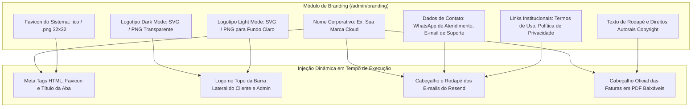

# Personalização & White-Label Branding

O módulo de identidade visual (`/admin/branding`) permite transformar o **Painel EQSAM** em uma solução **100% White-Label**, adaptando nomes, logotipos, cores e links institucionais para refletir a marca de qualquer empresa de hospedagem ou integrador de tecnologia.

---

## 🎨 Parâmetros de Customização Dinâmica

As configurações são persistidas na tabela `public.system_settings` e gerenciadas através de `src/lib/branding.ts`:

---

## ⚙️ Injeção Dinâmica sem Rebuild do Código

Diferente de sistemas engessados que exigem recompilação do frontend para alterar um logotipo:
1. **Zero Downtime:** Qualquer upload de nova logomarca ou alteração no nome corporativo é persistido no banco e propagado instantaneamente para todos os navegadores conectados através de revalidação de cache do TanStack Query.
2. **Documentos Oficiais Atualizados:** Faturas em PDF geradas em tempo real incorporam a logomarca e a razão social imediatamente após o salvamento.
3. **E-mails Transacionais com Assinatura da Empresa:** Notificações de cobrança e avisos de suporte utilizam o nome e logotipo salvos nas variáveis de branding, mantendo consistência visual total para o cliente final.
