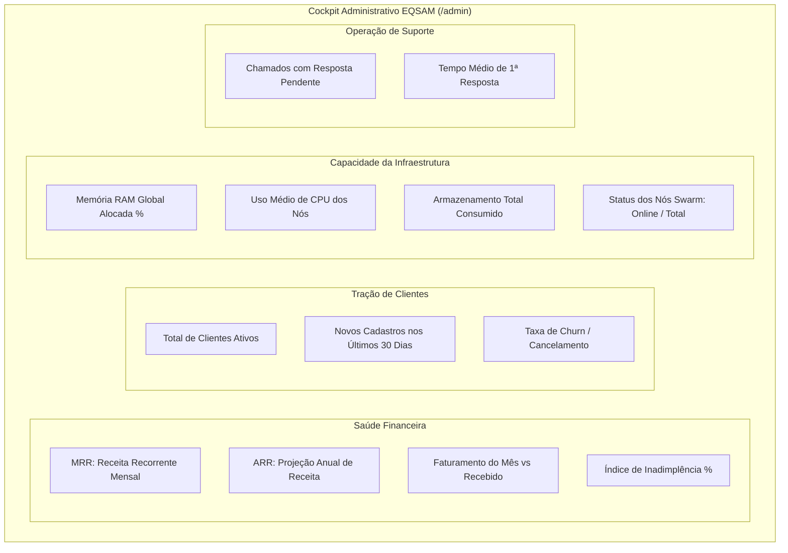

# Visão Geral & KPIs da Operação

O dashboard executivo do administrador (`/admin` e `/admin/index.tsx`) fornece aos diretores e gestores de infraestrutura uma visão consolidada da saúde financeira, do crescimento de clientes e da ocupação do cluster em tempo real.

---

## 📈 Métricas Executivas Principais (SaaS & Cloud KPIs)

A página inicial do módulo administrativo agrega quatro pilares estratégicos de dados calculados via `src/lib/dashboard-admin.functions.ts`:

---

## 🧭 Seções e Visualizações de Análise

### 1. Gráficos de Evolução Financeira
- **Curva de Receita Realizada:** Gráfico de barras e linhas demonstrando as entradas financeiras diárias, semanais e mensais.
- **Divisão por Gateway:** Comparativo de receita gerada por PIX automático, Cartão de Crédito ou Saldo de Carteira.

### 2. Ocupação e Saturação do Cluster de Servidores
Antes que a infraestrutura atinja pontos de estrangulamento, o dashboard projeta a saturação agregada de todos os servidores cadastrados:
- Se a média de uso de memória dos nós ultrapassar 75%, um alerta de expansão horizontal (adicionar novo nó ao Swarm) é sugerido ao administrador.
- Gráficos de dispersão de contêineres por servidor para identificar se há sobrecarga assimétrica em algum nó específico.

### 3. Fila de Ações Urgentes
Um painel de atenção imediata destaca:
- Faturas com comprovantes manuais aguardando aprovação.
- Serviços com erros de provisionamento que necessitam de intervenção técnica.
- Solicitações de saque de afiliados prontas para liquidação.
- Chamados de prioridade "Urgente" aguardando primeira resposta há mais de 30 minutos.
