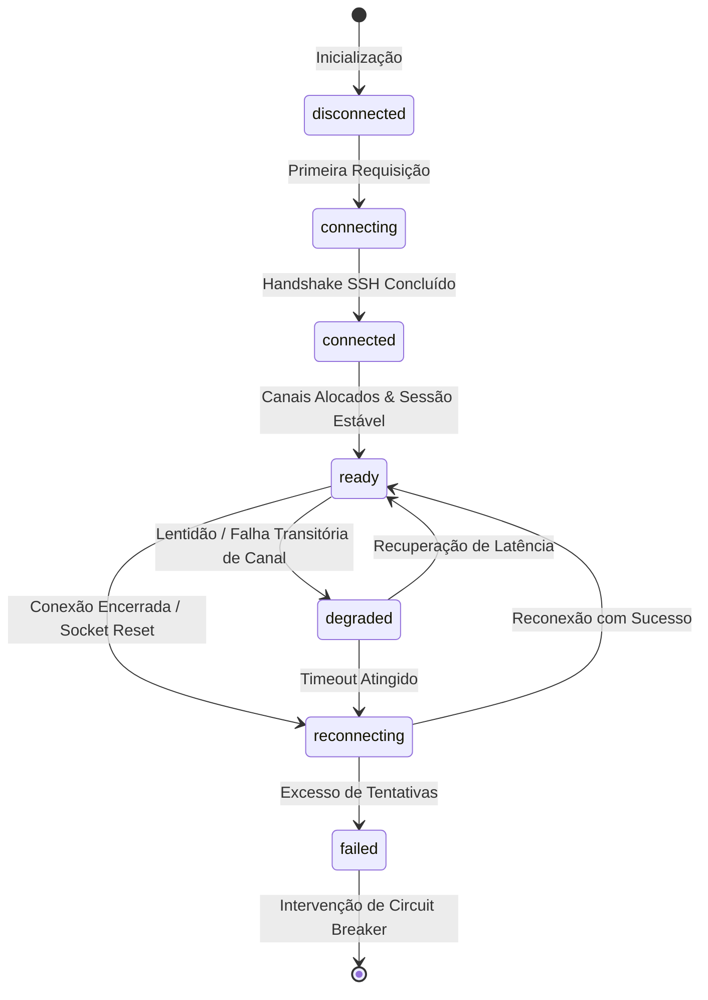
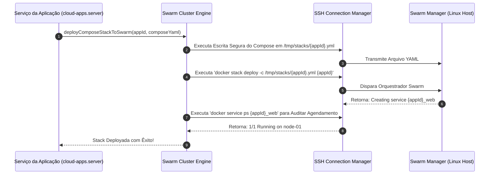

# Motor Docker Swarm & Pool SSH

O subsistema de orquestração do **Painel EQSAM** foi projetado para operar diretamente sobre o **Docker Swarm nativo através de túneis SSH seguros**, eliminando camadas intermediárias e garantindo controle absoluto de cada contêiner com tolerância a falhas e alta escalabilidade.

---

## 🔌 Camada de Transporte: Pool SSH Multiplexado

A comunicação com os servidores é realizada pelo gerenciador `src/lib/ssh-connection-manager.server.ts`, construído sobre a biblioteca `ssh2` do Node.js:



### Mecanismos de Alta Disponibilidade do Pool:
1. **Connection Pooling Persistente:** O painel não abre e fecha conexões TCP a cada comando. Ele mantém conexões ativas por host com keepalive ativo (`keepaliveInterval: 15000ms`), reutilizando a mesma sessão criptografada.
2. **Multiplexação Concorrente com Semáforo:** Múltiplas rotinas (ex: coleta de telemetria, inspeção de logs e criação de stack) rodam simultaneamente pela mesma conexão física, controladas por um limite de concorrência (`maxChannels`, padrão de 10 canais por servidor).
3. **Thundering Herd Prevention:** Se 50 clientes acessarem simultaneamente telas que consultam o mesmo servidor enquanto ele reconecta, apenas 1 handshake físico de autenticação é disparado no host; todas as outras 49 requisições aguardam a conclusão da mesma Promise.
4. **Circuit Breaker com 3 Estados:**
   - **`CLOSED`:** Operação regular, comandos fluem com latência de rede normal.
   - **`OPEN`:** Se falhas de conexão consecutivas atingirem o limiar de tolerância (3 falhas), o circuito abre por 30 a 60 segundos. Qualquer nova requisição falha instantaneamente com `CircuitBreakerOpenError`, protegendo o pool contra travamentos e evitando sobrecarga no host remoto.
   - **`HALF_OPEN`:** Ao expirar a janela de resfriamento, uma única chamada de teste é autorizada para sondar a recuperação do host. Se confirmada, o circuito retorna para `CLOSED`.

---

## 🐳 Orquestração no Swarm (`swarm-cluster.server.ts`)

A gestão das aplicações segue o padrão declarativo de stacks do Docker Swarm:



---

## 🚦 Roteamento de Borda: Traefik v3 & Rede Overlay

O tráfego de entrada da internet chega aos nós do cluster através da porta 80 (HTTP) e 443 (HTTPS):

1. **Rede Overlay `traefik-public`:**
   - Rede global distribuída (`driver: overlay, attachable: true`) compartilhada entre a stack do Traefik e todos os serviços de aplicações web dos clientes.
2. **Injeção de Rótulos Declarativos (Labels):**
   - Ao subir uma stack, o backend do EQSAM injeta automaticamente os metadados de roteamento para o Traefik:
     ```yaml
     deploy:
       labels:
         - "traefik.enable=true"
         - "traefik.docker.network=traefik-public"
         - "traefik.http.routers.app-123.rule=Host(`app.cliente.com`)"
         - "traefik.http.routers.app-123.entrypoints=websecure"
         - "traefik.http.routers.app-123.tls=true"
         - "traefik.http.routers.app-123.tls.certresolver=letsencrypt"
         - "traefik.http.services.app-123.loadbalancer.server.port=3000"
     ```
3. **Resolução de Desafio Let's Encrypt:**
   - O Traefik intercepta a rota, valida o certificado SSL e repassa o tráfego descriptografado internamente para o contêiner correto, mesmo que o contêiner esteja alocado em outro nó físico do cluster Swarm.
