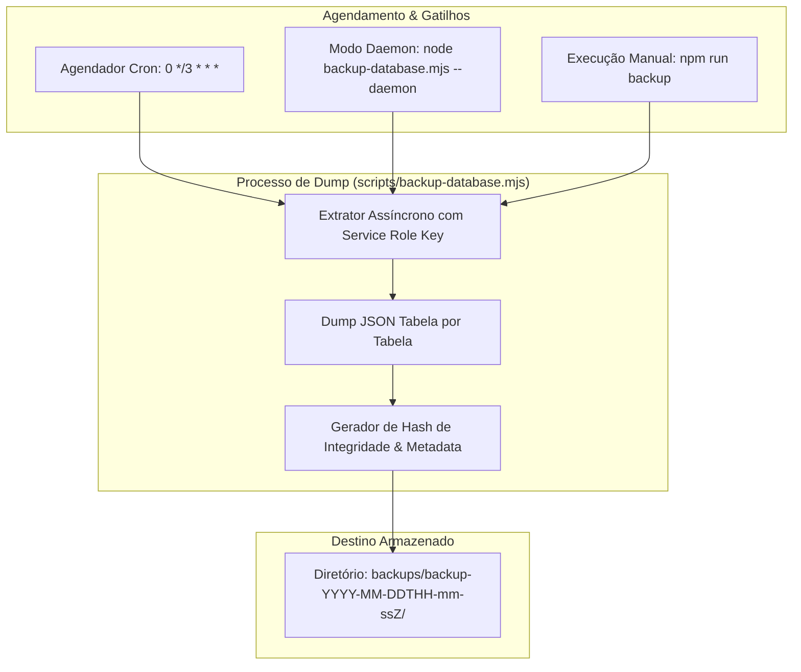

# Política de Backups & Disaster Recovery

A preservação e resiliência dos dados no **Painel EQSAM** são regidas por uma política inegociável de **backups periódicos a cada 3 horas** e procedimentos automatizados de recuperação de desastres (Disaster Recovery).

---

## 🛡️ Política de Backup do Banco de Dados

A persistência de todas as tabelas públicas (`profiles`, `user_roles`, `services`, `products`, `product_groups`, `invoices`, `tickets`, `ticket_messages`, `audit_logs`, `system_settings`) é executada ciclicamente pelo script oficial `scripts/backup-database.mjs`.



### Especificações Operacionais:
- **Frequência:** A cada 3 horas ininterruptas.
- **Destino no Servidor:** Diretório isolado `backups/backup-YYYY-MM-DDTHH-mm-ssZ/` no diretório raiz do projeto.
- **Estrutura Salva em Cada Backup:**
  - `manifest.json`: Data/hora exata, versão do sistema, quantidade total de registros e integridade.
  - `profiles.json`: Todos os dados de clientes e documentos fiscais.
  - `services.json`: Assinaturas, quotas contratadas e vínculos de nós.
  - `invoices.json`: Histórico financeiro, status de pagamento e comprovantes.
  - `tickets.json` & `ticket_messages.json`: Todos os chamados e conversas de suporte.
  - `audit_logs.json`: Trilha completa de auditoria imutável.
  - `products.json` & `product_groups.json`: Configurações de planos e precificação.
  - `system_settings.json`: Personalização de marca (White-label), logos e gateways.

---

## 🚀 Comandos de Execução de Backup

```bash
# Execução pontual via npm script
npm run backup

# Execução direta via Node.js
node scripts/backup-database.mjs

# Execução contínua como daemon de segundo plano
node scripts/backup-database.mjs --daemon
```

---

## 🔄 Procedimento de Disaster Recovery (Restauração Completa)

Em um cenário hipotético de falha catastrófica de hardware ou migração para um novo datacenter, o procedimento de restauração segue quatro etapas rigorosas:

### Passo 1: Inicialização da Infraestrutura e Banco Novo
1. Provisionar uma nova instância do PostgreSQL (Supabase ou PostgreSQL 15+ nativo).
2. Executar o script consolidado `full_schema.sql` através do SQL Editor ou CLI para recriar todas as tabelas, tipos ENUM, triggers e políticas RLS:
   ```bash
   psql -h <novo_host> -U postgres -d postgres -f full_schema.sql
   ```

### Passo 2: Seleção do Ponto de Restauração (Snapshot)
1. Navegue até o diretório `backups/` e selecione o diretório com timestamp mais recente.
2. Inspecione o arquivo `manifest.json` para verificar o total de registros esperados.

### Passo 3: Ingestão de Dados com Respeito à Ordem Topológica de Chaves Estrangeiras
A importação dos arquivos JSON deve seguir a ordem de dependência relacional:
1. `system_settings.json` e `product_groups.json`
2. `products.json`
3. `profiles.json` e `user_roles.json`
4. `services.json`
5. `invoices.json`
6. `tickets.json` seguido por `ticket_messages.json`
7. `audit_logs.json`

### Passo 4: Verificação de Integridade e Inicialização do Painel
1. Executar consulta de contagem de linhas (`SELECT count(*)`) em cada tabela para certificar que o número de registros coincide com o `manifest.json`.
2. Iniciar a aplicação Node.js:
   ```bash
   npm run build
   npm run start
   ```
3. O painel restabelece imediatamente a comunicação com os nós do cluster Docker Swarm via SSH, recuperando o controle de todas as stacks ativas.
