# Painel EQSAM — Documentação Oficial & Manual de Engenharia

> **Plataforma Moderna de Hospedagem Cloud, PaaS Distribuído e Gestão Integrada de Infraestrutura**

Bem-vindo à documentação técnica e operacional do **Painel EQSAM**. Este repositório de documentação foi estruturado no padrão **GitBook** para fornecer uma referência exaustiva, precisa e profunda sobre cada subsistema, módulo, fluxo de dados, padrão visual e arquitetura do software.

---

## 🎯 Visão Geral da Plataforma

O **Painel EQSAM** é uma solução completa de Cloud Hosting e Platform-as-a-Service (PaaS), projetada para eliminar o atrito entre desenvolvedores, clientes corporativos e a infraestrutura física de servidores. 

Diferente de soluções convencionais baseadas em painéis legados ou ferramentas monolíticas de terceiros, o Painel EQSAM adota uma arquitetura **100% nativa em Docker Swarm orquestrado via SSH direto**, combinando alta disponibilidade, roteamento dinâmico de tráfego com Traefik, emissão automatizada de certificados SSL/TLS, faturamento automatizado com PIX instantâneo e gestão granular de clientes e servidores.

### Principais Capacidades:
1. **PaaS de Alta Performance:** Provisionamento em 1-clique de 21 stacks pré-configuradas (Next.js, WordPress, N8N, Evolution API WhatsApp, PocketBase, PostgreSQL, Redis, etc.) com cálculo automático de quota e margem de segurança de disco (+20%).
2. **Gerenciador de Arquivos Web Integrado:** File Manager completo com sandbox chroot estrita, upload seguro, edição de código inline e tarefas assíncronas de compactação e extração de arquivos ZIP via worker pool.
3. **Telemetria de Contêineres em Tempo Real:** Ingestão periódica de métricas de contêineres (`docker stats`), oferecendo gráficos temporais de CPU, memória RAM, consumo de disco e tráfego de rede com detecção proativa de gargalos de hardware.
4. **Billing & Faturamento Inteligente:** Sistema multi-ciclo de cobrança (mensal, trimestral, semestral, anual), integração com gateways de pagamento (CajuPay PIX automático, Asaas, MercadoPago), geração de faturas em PDF e carteira digital de créditos.
5. **Painel de Controle Unificado:** Experiência com alternância entre perfis de Cliente e Staff/Administrador, incluindo ferramenta de impersonação segura para suporte em tempo real.
6. **Design System Cyber-Minimalista:** Interface de altíssima densidade informacional, paleta escura OLED baseada no espaço de cor OKLCH com acentuações em verde neon/esmeralda, inspirada em Vercel, Linear e Cloudflare.

---

## 🏗️ Stack Tecnológica

| Camada | Tecnologia Principal | Descrição Técnica |
| :--- | :--- | :--- |
| **Frontend Framework** | React 19 + TypeScript | Interface declarativa com renderização reativa e tipagem estrita de ponta a ponta. |
| **Roteamento & SSR** | TanStack Router + TanStack Start | Roteamento baseado em arquivos com Server-Side Rendering e Server Functions integradas. |
| **Estilização & Tokens** | Tailwind CSS v4 + OKLCH Colors | Estilização utilitária de última geração, variáveis customizadas e paleta de alto contraste. |
| **Componentes de UI** | Radix UI + Lucide Icons + Shadcn | Primitivas acessíveis (WAI-ARIA), modais fluidos, dropdowns, gavetas e ícones vetoriais. |
| **Orquestração de Dados** | TanStack Query v5 | Cache inteligente, mutações otimistas, invalidação granular e refetch automático. |
| **Banco de Dados & Auth** | Supabase (PostgreSQL 15+) | Autenticação JWT, Row Level Security (RLS), triggers PL/pgSQL e armazenamento seguro. |
| **Orquestrador de Contêineres** | Docker Swarm (Engine Nativo) | Cluster distribuído de nós, serviços com overlay network, zero dependência de Coolify. |
| **Camada de Transporte** | SSH2 (Node.js) + Connection Pool | Multiplexação de conexões SSH, Circuit Breaker anti-falhas e keepalive permanente. |
| **Edge Router & Ingress** | Traefik Proxy v3 | Roteamento dinâmico via Docker labels, balanceamento de carga e Let's Encrypt HTTP-01. |
| **Comunicação Transacional** | Resend API + Evolution API | Disparo automatizado de e-mails transacionais e notificações instantâneas via WhatsApp. |

---

## 🗺️ Mapa de Navegação da Documentação

A documentação está organizada em 5 grandes seções conceituais:

```mermaid
graph TD
    DOCS[Documentação GitBook EQSAM]
    DOCS --> S1[01. Visão Geral & Arquitetura]
    DOCS --> S2[02. Design System & UX]
    DOCS --> S3[03. Módulos do Cliente]
    DOCS --> S4[04. Painel Administrativo]
    DOCS --> S5[05. Infraestrutura & Operações]

    S1 --> S1_1[Arquitetura do Sistema]
    S1 --> S1_2[Segurança e Resiliência]

    S2 --> S2_1[Paleta de Cores & Tokens OKLCH]
    S2 --> S2_2[Tipografia & Componentes]
    S2 --> S2_3[Inspiração & Filosofia Visual]

    S3 --> S3_1[Autenticação & Perfil]
    S3 --> S3_2[Dashboard Principal]
    S3 --> S3_3[PaaS & Cloud Apps]
    S3 --> S3_4[Web File Manager & Chroot]
    S3 --> S3_5[Domínios, DNS & Let's Encrypt]
    S3 --> S3_6[Telemetria & Gráficos]
    S3 --> S3_7[Financeiro & Carteira]

    S4 --> S4_1[KPIs & Gestão Executiva]
    S4 --> S4_2[Impersonação de Clientes]
    S4 --> S4_3[Gestão do Cluster Swarm]
    S4 --> S4_4[Auditoria & Logs]

    S5 --> S5_1[Pool SSH & Circuit Breaker]
    S5 --> S5_2[Catálogo de 21 Templates]
    S5 --> S5_3[Backups & Disaster Recovery]
```

Consulte o [Sumário Completo (SUMMARY.md)](SUMMARY.md) para acessar qualquer tópico detalhado diretamente.
